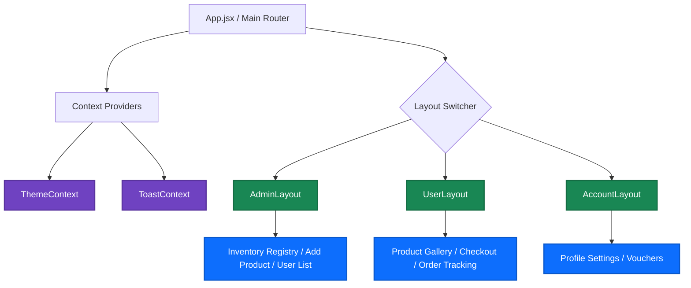

# 🛒 MicroMart Web: Enterprise E-Commerce Client

[](https://reactjs.org/)
[](https://vitejs.dev/)
[](https://tailwindcss.com/)
[](https://react.dev/learn/passing-data-deeply-with-context)
[](https://axios-http.com/)

**MicroMart Web** is the premium frontend interface for the MicroMart distributed microservices ecosystem. Built as a high-performance Single Page Application (SPA), it features a highly modular architecture, role-based layout rendering, and a custom "Liquid" theme engine. It provides an immersive shopping experience for users and a robust command center for platform administrators.

---

## ✨ Key Technical Features

* **🎨 Dual-Aesthetic Theme Engine:** Context-aware UI utilizing custom `LiquidBackground` components (Dark, Deep, Vibrant) to deliver a premium, animated visual identity without performance degradation.
* **🔐 Advanced Auth Orchestration:** Comprehensive lifecycle management including dual login portals (User vs. Admin), Email Verification, Password Recovery, and an automated `useSessionTimeout` security hook.
* **🖥️ Admin Command Center:** Dedicated management portal wrapped in an `AdminLayout`, featuring real-time Inventory Registries, User Auditing, and Payment dashboards.
* **📦 Optimized Rendering:** Utilizes `TableSkeleton` loaders and deferred data fetching to maintain a high Frame Rate (FPS) and low Cumulative Layout Shift (CLS).
* **💳 Agnostic Payment UI:** A custom `PaymentModal` interface that seamlessly connects to the API Gateway, handling Success/Cancel routing without leaking third-party SDKs into the UI layer.

---

## 🏗️ Architecture & Component Strategy

The application strictly adheres to the **Container/Presenter** and **Layout** design patterns. Routing is decoupled into specialized layout wrappers that automatically enforce Role-Based Access Control (RBAC) and UI consistency.



---

## 🛠️ Engineering Patterns

* **Layout Pattern:** Abstracted UI shells (`UserLayout`, `AdminLayout`) that inject contextual sidebars and navigation bars based on the current user's role.
* **Service Layer Pattern:** Network requests are centralized in `services/api.js`, utilizing Axios interceptors to automatically attach JWT tokens and handle 401 Unauthorized responses.
* **Custom Hook Pattern:** Reusable behavioral logic extracted into hooks like `useSessionTimeout` to keep React components purely presentational.
* **Global Context Pattern:** Lightweight global state management (`ThemeContext`, `ToastContext`) avoids the boilerplate overhead of Redux for UI-specific state.

---

## 📂 Project Structure

```text
src/
├── assets/          # Static media and global stylesheets
├── components/      # Shared UI Elements (CartDrawer, Snowfall, Modals)
├── contexts/        # Global Providers (Theme, Toast)
├── data/            # Static constants (countries.js)
├── hooks/           # Behavioral logic (useSessionTimeout)
├── layouts/         # Structural wrappers (Account, Admin, User)
├── pages/           # View-level component directories
│   ├── Account/     # Voucher and Profile views
│   ├── admin/       # Dashboards, Inventory, Users
│   ├── Auth/        # Login, Signup, Reset Password
│   ├── Dashboard/   # Shopping views, Orders, Product Details
│   ├── General/     # Checkout, Coming Soon placeholders
│   └── Payment/     # Success and Cancel confirmation views
├── services/        # Centralized Axios API configuration
└── views/           # Marketing/Specialty view components
```

---

## 🚀 Local Development Setup

### **1. Environment Configuration**
Create a `.env` file in the root directory to point to your local API Gateway:
```env
VITE_API_GATEWAY_URL=http://localhost:7082
```

### **2. Installation & Execution**
Ensure you have Node.js (v18+) installed.

```bash
# Install dependencies
npm install

# Start the Vite development server with HMR
npm run dev
```

### **3. Production Build**
```bash
# Build optimized static assets
npm run build

# Preview the production build locally
npm run preview
```

---

## 🎨 UI/UX Design System

The platform leverages **Tailwind CSS** for a highly responsive, utility-first design system. Specialized visual effects like `LiquidBackground` variants and `Snowfall` are implemented using a mix of pure CSS modules and React-driven DOM manipulation to ensure an engaging user experience across all device breakpoints.